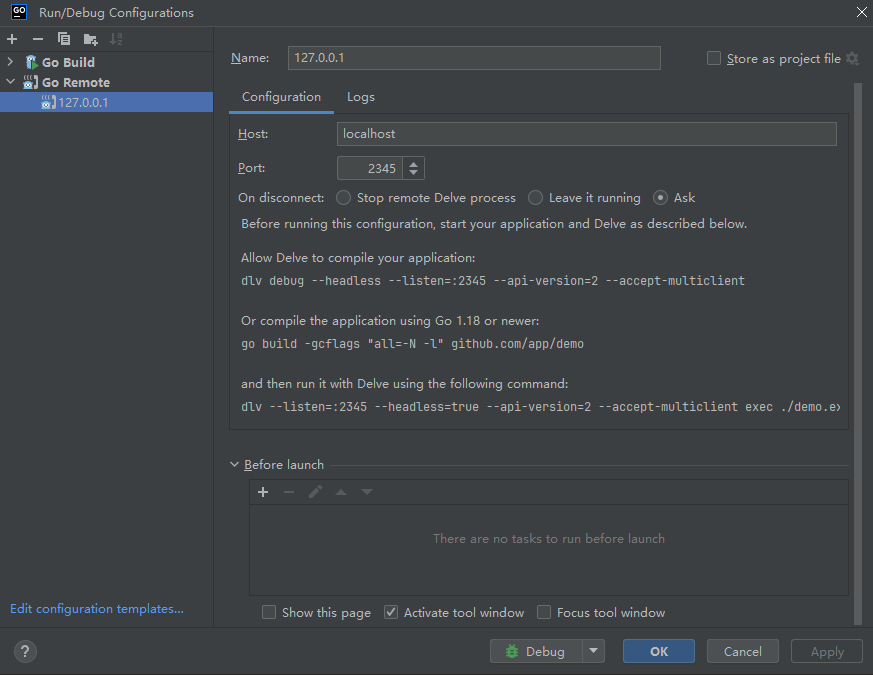

# Node Exporter

*Node Exporter 二次开发与功能拓展*

---

### 基于 Docker 的本地调试及服务安装

1. **进入 `./cmd` 目录，执行打包脚本启动服务，并生成 `node_exporter.tar.gz` 安装包**
   ```bash
   cd ./cmd
   ./build.cmd

2. **配置调试环境**
    - 打开 **Edit Configurations** 菜单
    - 点击 **Add New Configuration**，选择 **Go Remote**

   

3. **启动 Debug 模式**  
   访问以下地址进行调试：[http://127.0.0.1:9100/metrics](http://127.0.0.1:9100/metrics)

4. **将 `node_exporter.tar.gz` 文件上传至目标服务器**

5. **解压`node_exporter.tar.gz`**
   ```shell
   tar -xvf node_exporter.tar.gz
   ```
   **解压成功后获得如下目录**
   ```text
   ├── shell
   ├── node_exporter
   └── install.sh
    ``` 

6. **执行 `install.sh` 安装服务**
   ```shell
   sh install.sh

7. **查看服务存活状态**
   ```shell
   systemctl status node-exporter

---

### 采集时执行脚本实现自定义指标采集

1. **编写自定义 Shell 脚本**  
   将脚本放在项目 `./cmd/shell` 目录下，确保脚本的标准输出符合以下格式：

   ```text
   # HELP metric_name metric_help.
   # TYPE metric_name metric_type
   metric_name{label="value"} metric_value

2. **上传脚本至目标主机**
    - 启动 exporter 时，通过 `--collector.shellfile.directory=/xxxx` 指定脚本存放路径。

---

### metrics

**shellfile收集器相关指标**

| 名称                           | help                                               | 含义      | 
|------------------------------|----------------------------------------------------|---------|
| node_shellfile_mtime_seconds | Unixtime mtime of shellfiles successfully execute. | 执行脚本耗时  |  
| node_shellfile_scrape_error  | Number of errors while executing shell files.      | 执行脚本出错数 | 

**已支持的自定义业务指标**

| 名称                       | help                                                | 含义              | 来源                        |
|--------------------------|-----------------------------------------------------|-----------------|---------------------------|
| node_cpu_physical_cores  | Number of physical CPU cores on the node.           | cpu物理核数         | lscpu                     |
| node_cpu_frequency_hertz | Current frequency of the CPU in hertz.              | cpu主频           | lscpu 或 cat /proc/cpuinfo |
| nfs_read_iops            | IOPS for read operations.                           | 读取操作的 IOPS      | nfsiostat                 |
| nfs_read_rate            | Read rate in kB/s.                                  | 读取速率（kB/s）      | nfsiostat                 |
| nfs_read_avg_rtt         | Average round trip time in ms for read operations.  | 读取操作的平均往返时间（ms） | nfsiostat                 |
| nfs_read_avg_exe         | Average execution time in ms for read operations.   | 读取操作的平均执行时间（ms） | nfsiostat                 |
| nfs_write_iops           | IOPS for write operations.                          | 写入操作的 IOPS      | nfsiostat                 |
| nfs_write_rate           | Write rate in kB/s.                                 | 写入速率（kB/s）      | nfsiostat                 |
| nfs_write_avg_rtt        | Average round trip time in ms for write operations. | 写入操作的平均往返时间（ms） | nfsiostat                 |
| nfs_write_avg_exe        | Average execution time in ms for write operations.  | 写入操作的平均执行时间（ms） | nfsiostat                 |
